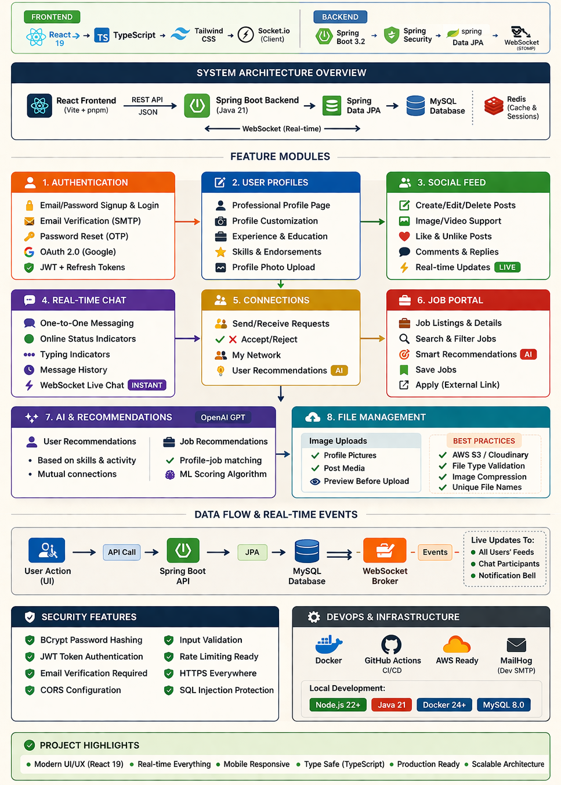

<div align="center">
  
</div>

<div align="center">

# JOb Portal (LinkedIn clone)

A **production-ready LinkedIn Clone** built with **Spring Boot + React (TypeScript)**, featuring
real-time messaging, a fully functional **Jobs Portal**, professional profiles, social feed,
networking, and OAuth 2.0 authentication.


</div>

---

## ✨ Features

### 🔐 Authentication & Security
- JWT-based Signup & Login with token stored in `localStorage`
- Email Verification via SMTP (MailHog in dev)
- Password Reset with expiring OTP tokens
- OAuth 2.0 — Google Sign-In (OIDC)
- Custom `AuthenticationFilter` guards all `/api/*` routes

### 👤 User Profiles
- Full profile setup wizard (name, position, company, location, about)
- Profile & cover picture upload with live preview
- **Experience** section — current role & company
- **Skills** section — rendered as tag chips from profile data
- **Education** section
- Profile completeness gate before accessing the app

### 🌐 Networking
- Send, accept, reject, and cancel connection requests
- Smart connection suggestions (scored by company / position / location similarity + mutual connections)
- Real-time invitation badges via WebSocket

### 📰 Social Feed
- Create, edit, and delete posts (text + optional image)
- Like / unlike posts with live like count
- Nested comments — add, edit, delete
- Personalized feed (connections only)
- Real-time post delivery via WebSocket

### 💼 Jobs Portal *(new)*
- **Post a job** — title, company, location, description, job type, work type, salary, requirements
- **Browse all jobs** — responsive 3-column layout (filters | listings | detail panel)
- **Search & filter** — keyword, location, job type (`FULL_TIME` / `PART_TIME` / `CONTRACT` / `INTERNSHIP` / `TEMPORARY` / `VOLUNTEER`), work type (`ON_SITE` / `REMOTE` / `HYBRID`)
- **Job detail panel** — full description, requirements, poster card, badges
- **Easy Apply** — one-click apply with optional cover letter
- **My Applications tab** — see every job you've applied to and its status
- **Delete your own postings** — poster-only delete button in the detail panel
- Duplicate application prevention (backend-enforced)

### 💬 Real-Time Messaging
- One-to-one conversations
- Real-time message delivery via STOMP WebSocket
- Unread message badge in the header

### 🔔 Notifications
- Like and comment notifications with real-time delivery
- Unread badge counter in the header
- Mark individual notifications as read

### 🔍 User Search
- Full-text search via Hibernate Search (Lucene)
- Searches across `firstName`, `lastName`, `company`, and `position`

### 📁 File & Image Uploads
- Profile pictures, cover pictures, and post images
- Streamed from `/api/v1/storage/{filename}`
- Preview before upload

---

## 🛠 Tech Stack

| Layer | Technology |
|---|---|
| **Frontend** | React 18, TypeScript 5, Vite, SCSS Modules, React Router v6 |
| **Backend** | Spring Boot 3.3.4, Java 21, Gradle |
| **Database** | MySQL 9.1 (via JPA / Hibernate) |
| **Search** | Hibernate Search 7 + Lucene backend |
| **Real-Time** | Spring WebSocket (STOMP over SockJS) |
| **Auth** | JWT (JJWT 0.12), OAuth 2.0 / OIDC (Google) |
| **Email** | Spring Mail + MailHog (dev SMTP) |
| **DevOps** | Docker, Docker Compose, GitHub Actions CI |

---

## 📁 Project Structure

```
linkedin-clone/
├── backend/
│   ├── src/main/java/com/linkedin/backend/
│   │   └── features/
│   │       ├── authentication/   # JWT, OAuth, email verify, password reset
│   │       ├── feed/             # Posts, comments, likes
│   │       ├── jobs/             # ✨ Jobs portal (NEW)
│   │       │   ├── controller/   # JobController
│   │       │   ├── dto/          # JobDto, JobApplicationDto
│   │       │   ├── model/        # Job, JobApplication, enums
│   │       │   ├── repository/   # JobRepository, JobApplicationRepository
│   │       │   └── service/      # JobService
│   │       ├── messaging/        # Conversations, messages
│   │       ├── networking/       # Connections, invitations
│   │       ├── notifications/    # In-app notifications
│   │       ├── search/           # Lucene full-text search
│   │       ├── storage/          # File serving
│   │       └── ws/               # WebSocket broker config
│   ├── docker-compose.yml        # MySQL + MailHog
│   └── build.gradle.kts
│
└── frontend/
└── src/
├── components/
│   └── Header/           # Global nav (Home, Network, Jobs ✨, Messaging, Notifications)
├── features/
│   ├── authentication/
│   ├── feed/
│   ├── jobs/             # ✨ Jobs page (NEW)
│   │   └── pages/Jobs/   # Jobs.tsx + Jobs.module.scss
│   ├── messaging/
│   ├── networking/
│   ├── profile/          # Profile page (Experience, Skills, Education fixed ✨)
│   └── ws/
└── main.tsx              # Router (includes /jobs route)
```

---

## 🌐 API Endpoints

### Authentication `/api/v1/authentication`
| Method | Endpoint | Description |
|--------|----------|-------------|
| `POST` | `/login` | Email/password login |
| `POST` | `/register` | Register new user |
| `POST` | `/oauth/google/login` | Google OAuth |
| `PUT` | `/validate-email-verification-token` | Verify email |
| `GET` | `/send-email-verification-token` | Send verification email |
| `PUT` | `/send-password-reset-token` | Send password reset email |
| `PUT` | `/reset-password` | Reset password with token |
| `PUT` | `/profile/{id}/info` | Update profile info |
| `PUT` | `/profile/{id}/profile-picture` | Upload profile picture |
| `PUT` | `/profile/{id}/cover-picture` | Upload cover picture |
| `GET` | `/users/me` | Get authenticated user |
| `GET` | `/users/{id}` | Get user by ID |

### Feed `/api/v1/feed`
| Method | Endpoint | Description |
|--------|----------|-------------|
| `GET` | `/` | Get personalized feed (connections) |
| `GET` | `/posts` | Get all posts |
| `POST` | `/posts` | Create post |
| `GET` | `/posts/{id}` | Get single post |
| `PUT` | `/posts/{id}` | Edit post |
| `DELETE` | `/posts/{id}` | Delete post |
| `PUT` | `/posts/{id}/like` | Toggle like |
| `POST` | `/posts/{id}/comments` | Add comment |
| `PUT` | `/comments/{id}` | Edit comment |
| `DELETE` | `/comments/{id}` | Delete comment |

### Jobs `/api/v1/jobs` ✨
| Method | Endpoint | Description |
|--------|----------|-------------|
| `GET` | `/` | Get all jobs (newest first) |
| `POST` | `/` | Post a new job |
| `GET` | `/search?keyword=&location=&jobType=&workType=` | Search & filter jobs |
| `GET` | `/{id}` | Get job by ID |
| `GET` | `/user/{userId}` | Get jobs posted by user |
| `DELETE` | `/{id}` | Delete job (poster only) |
| `POST` | `/{id}/apply` | Apply to a job |
| `GET` | `/{id}/applied` | Check if current user applied |
| `GET` | `/applications/my` | Get my applications |
| `GET` | `/{id}/applications` | Get applicants for a job (poster only) |

### Networking `/api/v1/networking`
| Method | Endpoint | Description |
|--------|----------|-------------|
| `GET` | `/connections` | List connections |
| `POST` | `/connections?recipientId=` | Send connection request |
| `PUT` | `/connections/{id}` | Accept request |
| `DELETE` | `/connections/{id}` | Reject / cancel |
| `GET` | `/suggestions?limit=` | Connection recommendations |

### Messaging `/api/v1/messaging`
| Method | Endpoint | Description |
|--------|----------|-------------|
| `GET` | `/conversations` | List conversations |
| `POST` | `/conversations` | New conversation |
| `POST` | `/conversations/{id}/messages` | Send message |
| `PUT` | `/conversations/messages/{id}` | Mark as read |

### Notifications `/api/v1/notifications`
| Method | Endpoint | Description |
|--------|----------|-------------|
| `GET` | `/` | Get notifications |
| `PUT` | `/{id}` | Mark as read |

### Search `/api/v1/search`
| Method | Endpoint | Description |
|--------|----------|-------------|
| `GET` | `/users?query=` | Full-text user search |

---

## 🔌 WebSocket Topics (STOMP)

| Topic | Event |
|-------|-------|
| `/topic/feed/{userId}/post` | New post published |
| `/topic/posts/{id}/likes` | Like count updated |
| `/topic/posts/{id}/comments` | New / edited comment |
| `/topic/posts/{id}/delete` | Post deleted |
| `/topic/users/{userId}/conversations` | New / updated conversation |
| `/topic/users/{userId}/notifications` | New notification |
| `/topic/users/{userId}/connections/new` | New invitation received |
| `/topic/users/{userId}/connections/accepted` | Invitation accepted |
| `/topic/users/{userId}/connections/remove` | Connection removed |
| `/topic/users/{userId}/connections/seen` | Invitation marked seen |

---

## 🚀 Running the Project

### Prerequisites

| Tool | Version |
|------|---------|
| Node.js | 22+ |
| npm | 10+ |
| Java JDK | 21 |
| Docker | 24.0.7+ |

---

### Backend Setup

**1. Navigate to the backend directory**
```bash
cd backend
```

**2. Start Docker containers (MySQL + MailHog)**
```bash
docker-compose up
```

**3. Start continuous build (skip tests)**

_Mac / Linux_
```bash
./gradlew build -t -x test
```
_Windows_
```bat
gradlew.bat build -t -x test
```

**4. (Optional) Configure Google OAuth environment variables**

_Mac / Linux_
```bash
export OAUTH_GOOGLE_CLIENT_ID=your_google_client_id
export OAUTH_GOOGLE_CLIENT_SECRET=your_google_client_secret
```
_Windows_
```bat
set OAUTH_GOOGLE_CLIENT_ID=your_google_client_id
set OAUTH_GOOGLE_CLIENT_SECRET=your_google_client_secret
```

**5. Run the backend**

_Mac / Linux_
```bash
./gradlew bootRun
```
_Windows_
```bat
gradlew.bat bootRun
```

---

### Frontend Setup

**1. Navigate to the frontend directory**
```bash
cd frontend
```

**2. Copy environment variables**

_Mac / Linux_
```bash
cp .env.example .env
```
_Windows_
```bat
copy .env.example .env
```

> ⚠️ Make sure all variables in `.env` are populated.  
> Leave `VITE_GOOGLE_OAUTH_CLIENT_ID` empty if you are not testing Google OAuth.

**3. Install dependencies**
```bash
npm install
```

**4. Start the development server**
```bash
npm run dev
```

---

### Access Points

| Service | URL |
|---------|-----|
| Frontend | http://localhost:5173 |
| Backend API | http://localhost:8080 |
| MailHog (SMTP UI) | http://localhost:8025 |
| MySQL | `127.0.0.1:3306` — db: `linkedin`, password: `root` |

---

## 🔧 Environment Variables

### Frontend (`.env`)

```env
VITE_API_URL=http://localhost:8080
VITE_GOOGLE_OAUTH_CLIENT_ID=         
VITE_GOOGLE_OAUTH_URL=
```

### Backend (`application.properties`)

```properties
spring.datasource.url=jdbc:mysql://127.0.0.1:3306/linkedin
spring.datasource.username=root
spring.datasource.password=root
spring.jpa.hibernate.ddl-auto=create
spring.mail.host=localhost
spring.mail.port=1025
```

---

## 🧪 CI/CD — GitHub Actions

To test the CI/CD workflows locally, install [`act`](https://github.com/nektos/act), then create a file named `event.json`:

```json
{
  "repository": {
    "default_branch": "main"
  },
  "push": {
    "base_ref": "refs/heads/main",
    "commits": [
      {
        "modified": ["frontend/some-file.js", "backend/some-file.java"]
      }
    ]
  }
}
```

Run the simulation:
```bash
act -e event.json
```

---

## 📸 Overview 

<div align="center">
  
</div>

---
