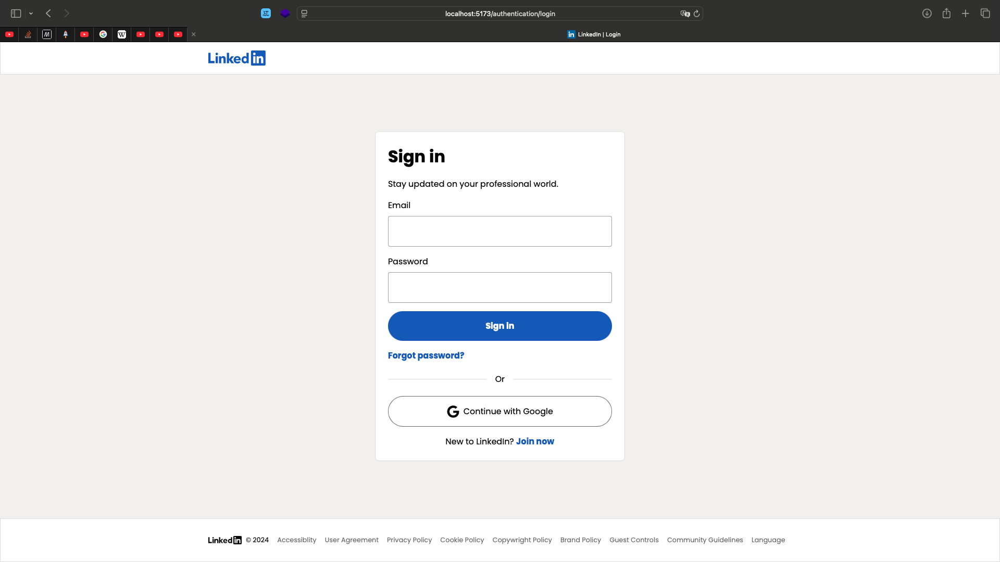

#  LinkedIn Clone – Full Stack Project

A **production-ready LinkedIn Clone** built using **Spring Boot + React**, featuring authentication, real-time communication, job portal, and AI-powered recommendations.

---

## ✨ Features

### 🔐 Authentication & Security
- JWT-based Signup & Login
- Email Verification (SMTP)
- Password Reset (OTP-based)
- OAuth 2.0 (Google Sign-In)

### 👤 User Profiles & Networking
- Create & update professional profiles
- Add skills, experience, and education
- Send/accept connection requests
- User recommendations

### 📰 Social Feed
- Create, edit, delete posts
- Like & comment system
- Real-time updates using WebSockets

### 💬 Real-Time Chat
- One-to-one messaging
- Online/offline status
- Typing indicators
- WebSocket-based communication

### 💼 Job Portal
- Job listings & details
- Search & filter jobs
- Save & apply to jobs
- AI-based job recommendations

### 🤖 AI Features
- User recommendations
- Job matching system
- OpenAI integration ready

### 📁 File & Image Uploads
- Profile & post media uploads
- Preview before upload
- File validation & best practices

---

## 🛠 Tech Stack

**Frontend:**
- React (Vite)
- TypeScript

**Backend:**
- Spring Boot
- Spring Security
- Spring Data JPA

**Database:**
- MySQL

**Real-Time:**
- WebSockets (STOMP)

**DevOps:**
- Docker
- GitHub Actions (CI/CD)

---
## Running the project on your machine

### Prerequisites

Node.js (version 22 or compatible), npm (version 10 or compatible),
Java JDK (version 21), and Docker (version 24.0.7 or compatible).

#### Backend Setup

Navigate to the backend directory:

```
cd backend
```

Run the docker containers:

```
docker-compose up
```

Set up continuous build:

_Mac/Linux:_

```
./gradlew build -t -x test
```

_Windows:_

```
gradlew.bat build -t -x test
```

Configure environment variables for OAuth 2.0 and OIDC, aka the Continue with Google button. Skip if you do not want to test this feature:

_Mac/Linux:_

```
export OAUTH_GOOGLE_CLIENT_ID=your_google_client_id
export OAUTH_GOOGLE_CLIENT_SECRET=your_google_client_secret
```

_Windows:_

```
set OAUTH_GOOGLE_CLIENT_ID=your_google_client_id
set OAUTH_GOOGLE_CLIENT_SECRET=your_google_client_secret
```

Run the backend:

_Mac/Linux:_

```
./gradlew bootRun
```

_Windows:_

```
gradlew.bat bootRun
```

#### Frontend Setup

Navigate to the frontend directory:

```
cd frontend
```

Set up the necessary environment variables:

_Mac/Linux:_

```
cp .env.example .env
```

_Windows:_

```
copy .env.example .env
```

⚠️: make sure all variables are populated. Leave `VITE_GOOGLE_OAUTH_CLIENT_ID` as is if you do not want to test Oauth 2.0 and OIDC.

Install dependencies:

```
npm install
```

Run the frontend in development mode:

```
npm run dev
```

You can access the backend at `http://localhost:8080`, the frontend at `http://localhost:5173`, and the Mailhog SMTP server UI at `http://localhost:8025`.

The database hostname is `127.0.0.1`, the port is `3306`, and the root password is `root`.

### Github Actions

To test the CI/CD workflows locally, you can use the `act` tool. First, ensure you have `act` installed. Then, create a file named `event.json` with the following content (to simulate modifications to both frontend and backend):

```json
{
  "repository": {
    "default_branch": "main"
  },
  "push": {
    "base_ref": "refs/heads/main",
    "commits": [
      {
        "modified": ["frontend/some-file.js", "backend/some-file.java"]
      }
    ]
  }
}
```

Run the following command to simulate a push event:

```
act -e event.json
```
